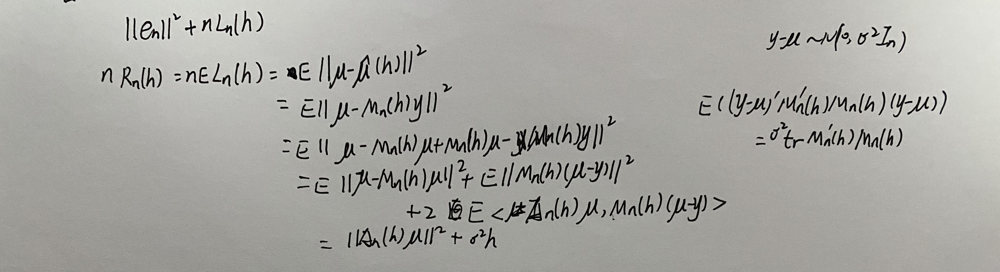
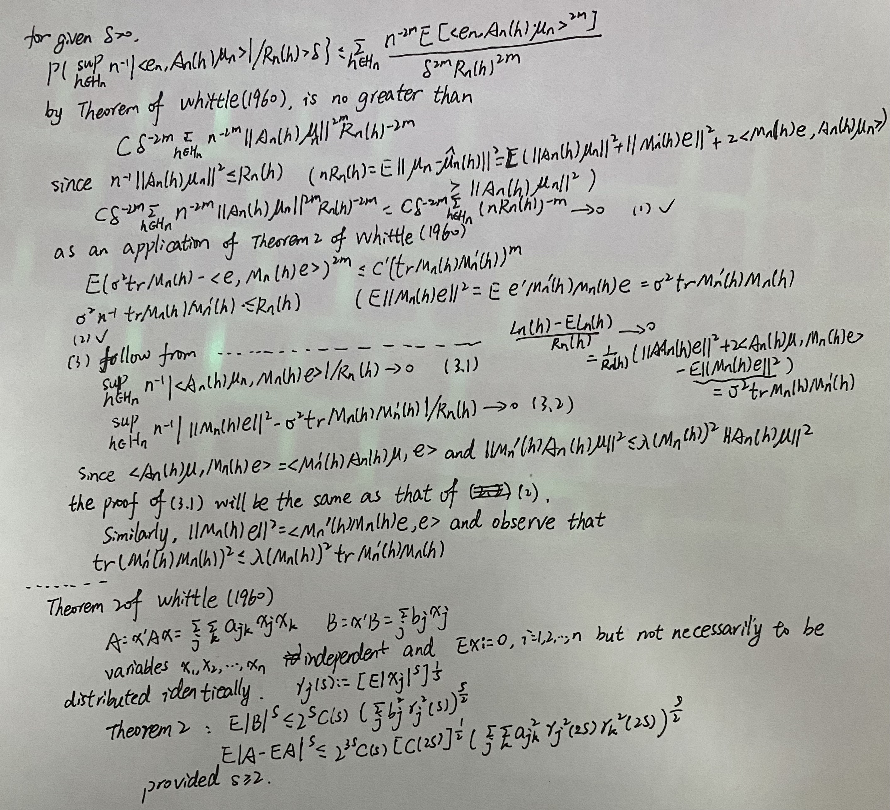

## Intro

Let $y=(y_1,\cdots,y_n)'$ be a vector of $n$ independent observations with unknown mean $\mu=(\mu_1,\cdots,\mu_n)'$. Write
$$
y_i=\mu_i+e_i,\ i=1,\cdots,n,
$$
and assume that the random errors $e_i$ are i.i.d. with mean 0 and variance $\sigma^2$. Suppose that to estimate $\mu$, a class of linear estimators $\hat{\mu}(h)=M_n(h)y$, indexed by $h{\in}H_n$, is proposed. Here $M_n(h)$ is an $n{\times}n$ matrix and $H_n$ is  just an index set. After observing the $y_i'$s, our concern is to select an $\hat{h}$ from $H_n$ so that the average squared error $L_n(\hat{h})=||\mu-\hat{{\mu}}(\hat{h})||^2/n$ may be as small as possible ($||\cdot||$ denotes the Euclidean norm).

$\textbf{Example 1}$ Model selection: Select the first $h$ variables to propose a linear model $y_i=\sum_{j=1}^hx_{ij}\beta_j+e_i$. Then $\hat{\mu}(h)=X_h(X_h'X_h)X_h'y$ to estimate $\mu$. Here $H_n=\{1,2,\cdots,p_n\}$. Our goal is to determine an appropriate model for the purpose of estimating $\mu$.

$\textbf{Example 2}$ Nearest-neighbor nonparametric regression: Let $p$ be a natural number and $X$ be the compact closure of an open connected set in $\mathbb{R}^p$. Suppose $y_1,\cdots,y_n$ are observed at distinct levels $\mathbf{x}_1,\cdots,\mathbf{x}_n$, which become dense in $X$ as $n{\rightarrow}\infty$. Assume that $\mu_i=f(\mathbf{x}_i)$ for an unknown continuous function $f$ on $X$. 

An $h$-nearest-neighbor estimate of $f$ at $\mathbf{x}_i$ depends only on the $h$ observations whose $\mathbf{x}$ values are closed to $\mathbf{x}_i$. 

Let $\mathbf{x}_{i(j)}$ denote the $j$-th nearest neighbor of $\mathbf{x}_i$. 

For a given weight function $w_{n,h}(\cdot)$, the $h$-nearest-neighbor estimate of $\mu_i$ is 

$$
\hat{\mu}_i(h)=\sum_{j=1}^h w_{n,h}(j) y_{i(j)}.
$$
Here $H_n=\{1,2,\cdots,n\}$.

For these two examples, the index set $H_n$ is discrete and has finite cardinality.

Three well-known procedures of selecting $h$ will be studied:

+ Mallows' $C_L$ [Mallows (1973)]: Select $\hat{h}$, denoted by $\hat{h}_M$, that achieves

  $$
  min_{h{\in}H_n}n^{-1}||y-\hat{\mu}(h)||^2+2\sigma^2n^{-1}trM_n(h).
  $$

+ GCV [Craven and Wahba (1979)]: Select $\hat{h}$, denoted by $\hat{h}_G$, that achieves

  $$
  min_{h{\in}H_n}\frac{n^{-1}||y-\hat{\mu}(h)||^2}{(1-n^{-1}trM_n(h))^2}.
  $$

+ (Delete-one) CV [Allen (1974), Stone (1974), Geisser(1975) and Wahba and Wold (1975)]: Select $\hat{h}$, denoted by $\hat{h}_C$, if we write the predictor of $y_i$ as $\hat{y}_{-i}=\sum_{j=1}^n\tilde{m}_{ij}(h)y_j$ with $\tilde{m}_{ii}(h)$ being zero. Then $\hat{h}_c$ achieves

  $$
  min_{h{\in}H_n}||y-\widetilde{M}_n(h)y||^2,
  $$
  where $\widetilde{M}_n(h)$ is an $n{\times}n$ matrix with $\tilde{m}_{ij}(h)$ as the $ij$th entry.

$\textbf{Example 1}$ Model selection (continued): Since $M_n(h)$ is a projection with rank $h$, the $C_L$ reduces to $C_p$ criterion. And GCV happens to take a form almost identical to another procedure $S_p$ proposed in Hocking (1976), and Thompson (1978). For delete-one CV, $y_i$ is predicted by $\hat{y}_{-i}=\mathbf{x}_i'(X_{h,-i}'X_{h,-i})^{-1}X_{h,-i}'y_{-i}$, where $y_{-i}$ is the subvector of $y$ with the $i$th coordinate deleted. Let $D_n(h)$ be an $n{\times}n$ diagonal matrix with the $i$-th diagonal element equal to $(1-m_{ii}(h))^{-1}$. Then the delete-one estimate of $\mu$ takes the form $\widetilde{M}_n(h)y$ with
$$
\widetilde{M}_n(h)=D_n(h)(M_n(h)-I)+I.
$$

$\textbf{Example 2}$ ...

The primary goal of this paper is to demonstrate that under reasonable conditions, these procedures are asymptotically optimal in the sense that 
$$
\frac{L_n(\hat{h})}{inf_{h{\in}H_n}L_n(h)}{\rightarrow}1,\ \text{in probability}.
$$

## $C_p$ and $C_L$

Let $\mathbf{e}=(e_1,\cdots,e_n)'$ and $A_n(h)=I-M_n(h)$. First, observe the identity

$$
n^{-1}||y-\hat{\mu}(h)||^2+2\sigma^2n^{-1}trM_n(h)\\
=n^{-1}||\mathbf{e}||^2+L_n(h)+2n^{-1}<\mathbf{e},A_n(h)\mu>\\
+2n^{-1}(\sigma^2trM_n(h)-<\mathbf{e},M_n(h)\mathbf{e}>).
$$

Since $||\mathbf{e}||^2$ is dependent of $h$, $\hat{h}_M$ also minimizes
$$
L_n(h)+2n^{-1}<\mathbf{e},A_n(h)\mu>
+2n^{-1}(\sigma^2trM_n(h)-<\mathbf{e},M_n(h)\mathbf{e}>)
$$
over $h{\in}H_n$. If we can show that the last two terms are negligible compared with $L_n(h)$ uniformly for any $h{\in}H_n$ then the asymptotic optimality property is established for $\hat{h}=\hat{h}_M$. More precisely, it remains to show that in probability,
$$
\begin{equation}
  sup_{h{\in}H_n}n^{-1}<\mathbf{e},A_n(h)\mu>/R_n(h){\rightarrow}0,
\end{equation}
$$

$$
\begin{equation}
sup_{h{\in}H_n}n^{-1}|\sigma^2trM_n(h)-<\mathbf{e},M_n(h)\mathbf{e}>|/R_n(h){\rightarrow}0
\end{equation}
$$

$$
\begin{equation}
sup_{h{\in}H_n}|L_n(h)/R_n(h)-1|{\rightarrow}0.
\end{equation}
$$

$\textbf{Theorem 2.1.}$ Assume (A.1)-(A.3) hold. Where
$$
\begin{aligned}
&(A.1)\ \ \ \ lim_{n{\rightarrow}\infty}sup_{h{\in}H_n}\lambda(M_n(h))<\infty\\
&(A.2)\ \ \ \ Ee_1^{4m}<\infty\\
&(A.3)\ \ \ \ \sum_{h{\in}H_n}(nR_n(h))^{-m}{\rightarrow}0,
\end{aligned}
$$
here $R_n(h)=EL_n(h)$ and $\lambda(M_n(h))$ is the maximum singular value of $M_n(h)$. Then $C_L$ is asymptotic optimal.

### 2.1. Model Selection-Example 1

(A.1) holds obviously. To see that 
$$
(A.3')\ \ \ \ inf_{h{\in}H_n}nR_n(h){\rightarrow}\infty
$$
implies (A.3) with $m=2$, observe that
<!--  -->
$$
nR_n(h)=||A_n(h)\mu||^2+h\sigma^2{\ge}h\sigma^2.
$$
Hence for any fixed natural number $k$
$$
\begin{aligned}
  \sum_{h{\in}H_n}(nR_n(h))^{-2}&{\le}\sum_{h=1}^k(nR_n(h))^{-2}+\sigma^{-4}\sum_{h=k+1}^{p_n}h^{-2}\\
  &{\le}k(inf_{h{\in}H_n}nR_n(h))^{-2}+\sigma^{-4}\sum_{h=k+1}^{\infty}h^{-2}.
\end{aligned}
$$
This proves (A.3).

$\textbf{Corollary 2.1.}$ For the model-selection setting, $C_p$ is asymptotic optimal if (A.3') and (A.2) with $m=2$ are satisfied.

When $\sigma^2$ is unknown, we should replace it by an estimate.

$\textbf{Corollary 2.2.}$ If $\sigma^2$ is replaced by a consistent estimate $\hat{\sigma}^2$, then $C_p$ is still asymptotically optimal under (A.3') and (A.2) with $m=2$.

The other properties for GCV and delete-one CV $\textbf{TBC}$.

At last, we prove Theorem 2.1. 

<!--  -->
